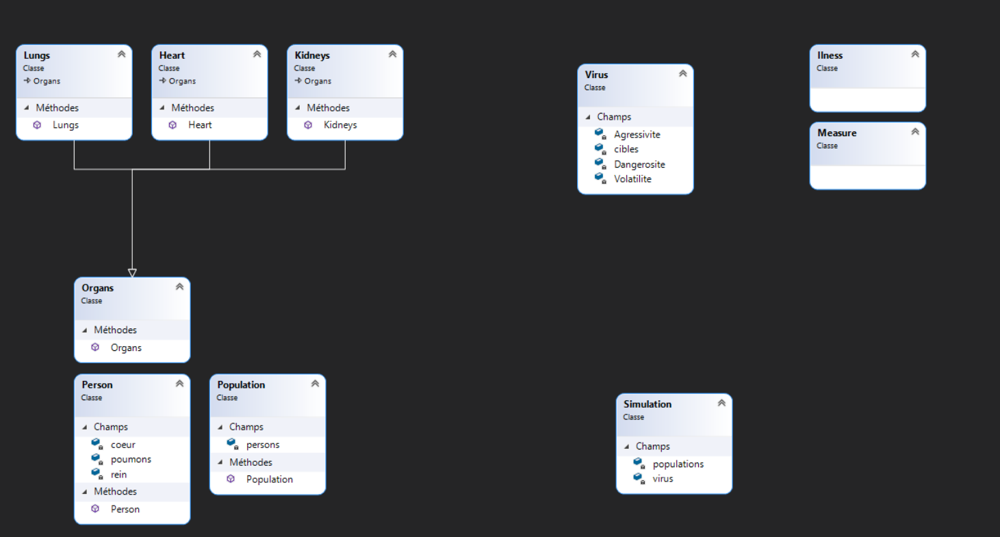

<h1> Cahier des charges</h1>

# 1. Titre
Covid propagation
# 2. Fonctionnalités
- Simulation
  - individus
    - uniques
    - Système immunitaire
      - organes
    - Patient à risque
    - Âge
    - Décès dû au virus
  - Virus
    - propagation
    - effets sur les individus
      - De “Aucun”
      - À “Grave”
  - Hôpitaux
    - Places limitée
  - Mesure de sécuritées
    - Port du masque
    - Quarantaine
    - Confinement global
    - Distanciation
  - Modifications en temps réel
    - Virus
    - Populations
- Carte
  - Région
    - Population unique
    - Hôpitaux et autres paramètres uniques
- Graphiques
  - Informations sur la population
    - Décès
    - Rétablissements
    - Infecté
    - Sains
  - Informations sur le virus
    - Dangerosité

## 2.1. Fonctionnalités aditionnels
- Carte mondiale
  - Transports
    - Avions
    - Bateaux
    - Aéroports et ports réel

# 3. Matériel et logiciels
- Pc techniciens
- Visual studio 2019
- Une connexion internet
- Github

# 4. Prérequis
- C#
- Visual studio 2019
- Dilemne du prisonnier

# 5. Descriptif complet du projet
## 5.1. Méthodologie
Scrum

## 5.2. Description de l’application
Simuler un grand nombre de personnes possédant tous des variables différentes (âge, résistance immunitaire,
etc...), y introduire le covid et observer la propagation du virus. Il est possible d’affecter des mesures de
sécurité, tel que le port du masque ou la distanciation pour observer la possible réduction de la propagation.
De réel données sont utilisées pour le taut de propagation ou autres éléments similaires.
L'affichage permet de voir en temps réel la propagation du virus et permet de visualiser chaque individue
distinctement au besoin. Des graphiques sont aussi présent pour avoir une idée en chiffres de ce que signifie
l'affichage.

# 6. Protocols de tests
Ce projet étant en c#, je vais utiliser les tests unitaires intégré dans visual studio. 
Les tests unitaires ne garantissant pas qu'il n'y ai aucun bug dans l'application, je vais créer des scénarios que je testerais avant et après chaque implémentation de fonctionnalités. Ces scénarios auront pour but de couvrir un maximum de possiblités pour éviter l'appartitions de bug dû à une modification du code ou l'ajout d'une fonctionnalité. Ils permettent aussi de trouver d'éventuels des problèmes d'ergonomie en me plongeant à la place d'un utilisateur.

# 7. Persona
## 7.1. Utilisateur experimenté

Figure 1: Persona experimenté

## 7.2. Utilisateur inexpérimenté

Figure 2: Persona inexpérimenté

# 8. User stories
## 8.1. Ashley
**En tant que** Ashley 
**Je veux** comparer différentes situations avec différente personnes en prenant des mesures identiques 
**Afin de** pouvoir observer les différences et déterminer quelle mesures est éfficace dans quelle situation. 

**scénarios**
Je crée sans soucis une situtations à l'aide de l'application. Pour ce faire, j'entre différents paramètres, tel que le nombre de personnes, les mesures prisent pour limiter la transmissions ainsi que d'autres paramètres.  
J'obsèrve la simulation et prend note des résultats.  
Une fois terminée, j'en lance une autres avec certains paramètres différents et prends note des résultats. 
Je compare les résultats avec la simulation précédente et effectue ma conclusion.

## 8.2. Kanan
**En tant que** Kanan 
**Je veux** vérifier l'éfficacité de différentes mesures prisent pour éviter la propagation du covid 
**Afin de** afin de me donner une idée concrète et visuel de l'éfficacité de ses mesures. 

**scénarios**
Je lance l'application et cherche à créer une simulation. Une fois trouvé, je peux voir les mesures qui aparaissent clairement, d'autres paramètres sont disponibles mais je n'y touches pas. 
Une fois la simulation lancée, je vois un message m'indiquant que celle-ci commence. 
Des aides sont disponibles me permettant de comprendre les données qui sont affichées.  
Après avoir terminé cette simulation, j'en lance une autre en désactivant les mesures.  
Je relance la simulation et observe la différence entre les deux simulations.  

# 9. Diagramme d'activité

Figure 3: Diagramme d'activité

# 10. Planning
https://docs.google.com/spreadsheets/d/1tSpIbcDVvGnzMhEN71UDwPOxEy0oapQSSbxzjqXt3RA/edit?usp=sharing

# 11. Diagramme de classe initial

Figure 4: Diagrame de classe initial

# 12. Exigences

|Exigences|QQOQCCP|
|:-------:|:-----:|
|Modifier les paramètres|- Quoi ? Modifier les générals paramètres de la simulation - Qui ? L'utilisateur -Où ? Dans l'onglet paramètre de l'application - Quand ? Avant de lancer une simulation - Comment ? En sélectionnant les options proposée ou en inscrivant par exemple le nombre d'individus dans une population - Combien ?  - Pourquoi ? Permettre à l'utilisateur de créer des simulations différentes |

|Modifier la population|- Quoi ? Modifier les paramètres de la population comme par exemple sa résistance au virus - Qui ? L'utilisateur -Où ? Dans l'onglet paramètre de l'application - Quand ? Avant de lancer une simulation et/ou lorsque la simulation est lancée pour certains paramètres - Comment ? En sélectionnant les options proposée - Combien ?  - Pourquoi ? Permettre à l'utilisateur de comparer différentes population en même temps et de la faire évoluer au besoin de la simulation |

|Modifier le virus|- Quoi ? Modifier les paramètres tu virus comme par exemple sa dangerosité - Qui ? L'utilisateur -Où ? Dans l'onglet paramètre de l'application - Quand ? Avant de lancer une simulation et/ou lorsque la simulation est lancée pour certains paramètres - Comment ? En sélectionnant les options proposée - Combien ?  - Pourquoi ? Pour permettre à l'utilisateur de personnaliser le virus et de voir les gestes barrières efficaces contre certains paternes |

|Modifier l'affichage|- Quoi ? Modifier l'affichage comme par exemple quels graphiques seront affichés - Qui ? L'utilisateur -Où ? Dans l'onglet paramètre de l'application - Quand ? Avant de lancer une simulation et/ou lorsque la simulation est lancée pour certains paramètres - Comment ? En sélectionnant les options proposée - Combien ?  - Pourquoi ? Pour permettre à l'utilisateur d'avoir un visuel intéressant ainsi que des données qui lui sont importantes |

|Générer la population|- Quoi ? Générer la population avec les paramètres choisis par l'utilisateur - Qui ? L'application -Où ? En BackEnd et dans l'affichage, une fois que la génération est terminée - Quand ? Lorsque l'utilisateur décide de lancer la simulation - Comment ? En générant cahque individus demandé par l'utilisateur avec des valeurs aléatoires, tous en restant dans les limites définient par l'utilisateur - Combien ?  - Pourquoi ? Car il est indispensable de simuler des individus pour une simulation de propagation de virus |

|Générer le virus|- Quoi ? Générer le virus avec les paramètres choisis par l'utilisateur - Qui ? L'application -Où ? En BackEnd et dans l'affichage, une fois que la génération est terminée - Quand ? Lorsque l'utilisateur décide de lancer la simulation - Comment ? En assignant le virus à un ou plusieurs individus au démarage de la simulation - Combien ?  - Pourquoi ? Car il est indispensable de simuler un virus dans une simulation de propagation de virus |

|Afficher la simulation|- Quoi ? Afficher la population ainsi que le virus dans une carte et/ou dans les graphiques choisis par l'utilisateur - Qui ? L'application -Où ? Sur la page principale de l'application - Quand ? Une fois que la simulation a fini d'être généré - Comment ? En utilisant des graphiques et une carte permettant d'informer l'utilisateur sur le nombre d'infecté ou sur les données qu'il a choisi d'afficher - Combien ?  - Pourquoi ? Car il est imporant d'avoir un retour en direct de ce qu'il se passe dans la simulation |

|Le virus doit se propager|- Quoi ? Le virus se transmet d'un individu à un autre en fonction des paramètres choisis - Qui ? L'application -Où ? En backend ainsi que dans les graphique par extension - Quand ? De façon aléatoir en fonction des paramètres choisis par l'utilisateur une fois que la simulation est lancée - Comment ? La méthode est encore incertaine - Combien ?  - Pourquoi ? Car il est indispensable de simuler la propagation d'un virus dans une simulation de propagation de virus |

|Les individus sont affecté par le virus|- Quoi ? Les individus ont des symptômes, meurent, où se rétablissent dû au virus - Qui ? L'application -Où ? En backend et frontEnd - Quand ? Lorsque la simulation est lancée. Arrive de façon aléatoir en fonction des paramètres de l'utilisateur - Comment ? En réduisant leur santé d'une façon ou d'une autre ou simplement en supprimant l'entité infecté lorsqu'elle "meurt" - Combien ?  - Pourquoi ? Car certains virus peuvent modifier le comportement ou l'état de santé d'une personne, il est important de le reproduire |

|Les données sont sauvegardée dans la BDD|- Quoi ? Les données résultantes de la simulation tel que le nombre de rétablis sont sauvegardé dans une base de donnée local - Qui ? La BDD -Où ?  - Quand ? Lorsqu'une simulation se termine - Comment ? En récupérant les données résultantes de la simulation et en les sauvegardant dans une Base de données local - Combien ?  - Pourquoi ? Car certaines données peuvent être utilent et il est important de garder une trace de celle-ci |

|Les hôpitaux se remplissent|- Quoi ? Les individus infecté sont traité dans les hôpitaux - Qui ? L'application -Où ? Backend, frontend - Quand ? Lorsque des maladent souffrent de certains symptoms - Comment ? Simplement en assignant certains malade aux hôpitaux - Combien ?  - Pourquoi ? Car c'est une variable importante qui peut permettre à rendre le résultat plus réaliste |

|Les hôpitaux ont une limite|- Quoi ? Les hôpitaux se remplissent jusqu'à une limite maximal et arrêtent de prendre des patients - Qui ? L'application -Où ? Backend, frontend - Quand ? Lorsque la limite d'individus est trop grande dans un hôpital (valeur fixe) - Comment ? Simplemen en donnant une valeur maximale de patient par hôpital - Combien ?  - Pourquoi ? Car les hôpitaux ne peuvent prendre un nombre infinis de patients |

# 13. Livrables
- Mind Map
- Planning
- Rapport de projet
- Manuel utilisateur
- Journal de travail ou LogBook
- Résumé / Abstract

