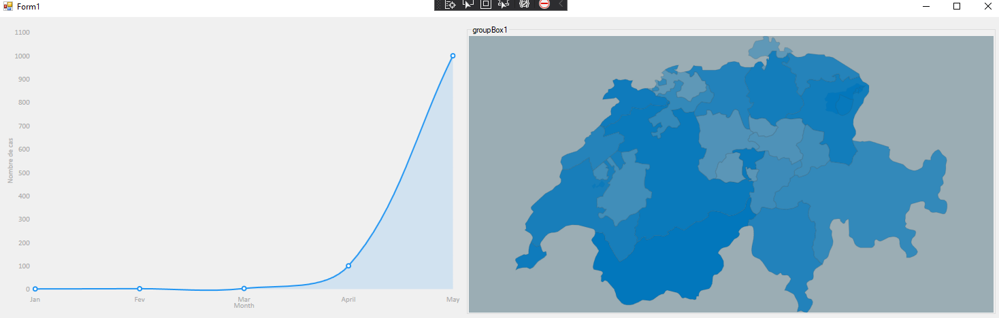

# Preuve de concept
## matériel
Aucun nécessaire en plus de celui déjà présent dans les postes techniciens.
## Technologie
### Grand nombre d'entités
[Microsoft ASP.NET](https://docs.microsoft.com/en-us/aspnet/web-forms/overview/older-versions-getting-started/continuing-with-ef/maximizing-performance-with-the-entity-framework-in-an-asp-net-web-application)

### Propagation

La propagation se fera entre individus se trouvant dans un même lieu. Suivant les chances d'infection qui seront définient par le virus, les mesures ainsi que par le nombre d'individus infecté dans un espace, les chances d'infection diminueront ou augmenteront à chaque itérations. 

SQL
[https://visualstudiomagazine.com/articles/2018/03/19/dapper-orm.aspx](https://visualstudiomagazine.com/articles/2018/03/19/dapper-orm.aspx)

Possible source de données
[https://covid19risk.biosci.gatech.edu/](https://covid19risk.biosci.gatech.edu/)

### Difficultées

#### Structure
La plus grosse difficultées du projet, est d'après moi la structure de la simulation. Créer une structure cohérente et suffisament complexe pour la simulation.

#### Calculer le nombre de reproduction

Calculer de réels données tel que le nombre de reproduction et recevoir des chiffres cohérent semble aussi être une grosse difficulté.
[Re](https://www.covid19.admin.ch/fr/repro/val)

#### Interface graphique

Les graphiques en eux même ne me semble pas être un problème vu la simplicité d'utilisation, par contre, pour avoir un affichage permettant de réellement visualiser les individus ainsi que les lieus. Réaliser une version bêta ne me semble pas compliqué, mais avoir quelque chose de cohérent dans la manière de se déplacer me semble impossible dans le temps imparti par le travail de diplôme.

### Affichage

Utilisation du framework LiveCharts.
[Graphiques](https://lvcharts.net/App/notfound)

### Graphiques

Concernant les graphiques, j'utilise le packet NuGet LiveCharts. Il permet de créer des graphiques en courbes dynamique. Grâce à cette extension, je peux me concentrer sur le fond en laisser la form et le graphisme de côté. Ce paquet NuGet utilise le .Net Framework 4.5.

~~les données des cartes peuvent être téléchargée depuis ce git:  
[Maps.xml](https://github.com/Live-Charts/Live-Maps/tree/master/Maps)~~

# 12. Exigences

|Exigences|QQOQCCP|
|:-------:|:-----:|
|Modifier les paramètres|- **`Quoi`** ? Modifier les générals paramètres de la simulation - **`Qui`** ? L'utilisateur - **`Où`** ? Dans l'onglet paramètre de l'application - **`Quand`** ? Avant de lancer une simulation - **`Comment`** ? En sélectionnant les options proposée ou en inscrivant par exemple le nombre d'individus dans une population - **`Combien`** ?  - **`Pourquoi`** ? Permettre à l'utilisateur de créer des simulations différentes |
|Modifier la population|- **`Quoi`** ? Modifier les paramètres de la population comme par exemple sa résistance au virus - **`Qui`** ? L'utilisateur - **`Où`** ? Dans l'onglet paramètre de l'application - **`Quand`** ? Avant de lancer une simulation et/ou lorsque la simulation est lancée pour certains paramètres - **`Comment`** ? En sélectionnant les options proposée - **`Combien`** ?  - **`Pourquoi`** ? Permettre à l'utilisateur de comparer différentes population en même temps et de la faire évoluer au besoin de la simulation |
|Modifier le virus|- **`Quoi`** ? Modifier les paramètres tu virus comme par exemple sa dangerosité - **`Qui`** ? L'utilisateur - **`Où`** ? Dans l'onglet paramètre de l'application - **`Quand`** ? Avant de lancer une simulation et/ou lorsque la simulation est lancée pour certains paramètres - **`Comment`** ? En sélectionnant les options proposée - **`Combien`** ?  - **`Pourquoi`** ? Pour permettre à l'utilisateur de personnaliser le virus et de voir les gestes barrières efficaces contre certains paternes |
|Modifier l'affichage|- **`Quoi`** ? Modifier l'affichage comme par exemple quels graphiques seront affichés - **`Qui`** ? L'utilisateur - **`Où`** ? Dans l'onglet paramètre de l'application - **`Quand`** ? Avant de lancer une simulation et/ou lorsque la simulation est lancée pour certains paramètres - **`Comment`** ? En sélectionnant les options proposée - **`Combien`** ?  - **`Pourquoi`** ? Pour permettre à l'utilisateur d'avoir un visuel intéressant ainsi que des données qui lui sont importantes |
|Générer la population|- **`Quoi`** ? Générer la population avec les paramètres choisis par l'utilisateur - **`Qui`** ? L'application - **`Où`** ? En BackEnd et dans l'affichage, une fois que la génération est terminée - **`Quand`** ? Lorsque l'utilisateur décide de lancer la simulation - **`Comment`** ? En générant cahque individus demandé par l'utilisateur avec des valeurs aléatoires, tous en restant dans les limites définient par l'utilisateur - **`Combien`** ?  - **`Pourquoi`** ? Car il est indispensable de simuler des individus pour une simulation de propagation de virus |
|Générer le virus|- **`Quoi`** ? Générer le virus avec les paramètres choisis par l'utilisateur - **`Qui`** ? L'application - **`Où`** ? En BackEnd et dans l'affichage, une fois que la génération est terminée - **`Quand`** ? Lorsque l'utilisateur décide de lancer la simulation - **`Comment`** ? En assignant le virus à un ou plusieurs individus au démarage de la simulation - **`Combien`** ?  - **`Pourquoi`** ? Car il est indispensable de simuler un virus dans une simulation de propagation de virus |
|Afficher la simulation|- **`Quoi`** ? Afficher la population ainsi que le virus dans une interface graphique et/ou dans les graphiques choisis par l'utilisateur - **`Qui`** ? L'application - **`Où`** ? Sur la page principale de l'application - **`Quand`** ? Une fois que la simulation a fini d'être généré - **`Comment`** ? En utilisant des graphiques et une interface graphique permettant d'informer l'utilisateur sur le nombre d'infecté ou sur les données qu'il a choisi d'afficher - **`Combien`** ?  - **`Pourquoi`** ? Car il est imporant d'avoir un retour en direct de ce qu'il se passe dans la simulation |
|Le virus doit se propager|- **`Quoi`** ? Le virus se transmet d'un individu à un autre en fonction des paramètres choisis - **`Qui`** ? L'application - **`Où`** ? En backend ainsi que dans les graphique par extension - **`Quand`** ? De façon aléatoir en fonction des paramètres choisis par l'utilisateur une fois que la simulation est lancée - **`Comment`** ? La méthode est encore incertaine - **`Combien`** ?  - **`Pourquoi`** ? Car il est indispensable de simuler la propagation d'un virus dans une simulation de propagation de virus |
|Les individus sont affecté par le virus|- **`Quoi`** ? Les individus ont des symptômes, meurent, où se rétablissent dû au virus - **`Qui`** ? L'application - **`Où`** ? En backend et frontEnd - **`Quand`** ? Lorsque la simulation est lancée. Arrive de façon aléatoir en fonction des paramètres de l'utilisateur - **`Comment`** ? En réduisant leur santé d'une façon ou d'une autre ou simplement en supprimant l'entité infecté lorsqu'elle "meurt" - **`Combien`** ?  - **`Pourquoi`** ? Car certains virus peuvent modifier le comportement ou l'état de santé d'une personne, il est important de le reproduire |
|Les données sont sauvegardée dans la BDD|- **`Quoi`** ? Les données résultantes de la simulation tel que le nombre de rétablis sont sauvegardé dans une base de donnée local - **`Qui`** ? La BDD - **`Où`** ?  - **`Quand`** ? Lorsqu'une simulation se termine - **`Comment`** ? En récupérant les données résultantes de la simulation et en les sauvegardant dans une Base de données local - **`Combien`** ?  - **`Pourquoi`** ? Car certaines données peuvent être utilent et il est important de garder une trace de celle-ci |
|Les hôpitaux se remplissent|- **`Quoi`** ? Les individus infecté sont traité dans les hôpitaux - **`Qui`** ? L'application - **`Où`** ? Backend, frontend - **`Quand`** ? Lorsque des maladent souffrent de certains symptoms - **`Comment`** ? Simplement en assignant certains malade aux hôpitaux - **`Combien`** ?  - **`Pourquoi`** ? Car c'est une variable importante qui peut permettre à rendre le résultat plus réaliste |
|Les hôpitaux ont une limite|- **`Quoi`** ? Les hôpitaux se remplissent jusqu'à une limite maximal et arrêtent de prendre des patients - **`Qui`** ? L'application - **`Où`** ? Backend, frontend - **`Quand`** ? Lorsque la limite d'individus est trop grande dans un hôpital (valeur fixe) - **`Comment`** ? Simplemen en donnant une valeur maximale de patient par hôpital - **`Combien`** ?  - **`Pourquoi`** ? Car les hôpitaux ne peuvent prendre un nombre infinis de patients |

<h1>Graphique radar pour le virus</h1>

[Radar](https://www.google.com/search?q=simulation+individu-centr%C3%A9&safe=strict&hl=fr&sxsrf=ALeKk02i1JrfYG4BydYqWTTmyPzPVs2aHg:1608542929961&source=lnms&sa=X&ved=0ahUKEwiiyciv4d7tAhVR26QKHaOcBOIQ_AUICigA&biw=1920&bih=969&dpr=1)

# Interactions
## Menu principal
- Affiche une préview de l'affichage de la simulation
- Btn Paramètres
  - Population
    - Remplace l'affichage actuel se situant à droite pour afficher les paramètres de la population
  - Virus
    - Remplace l'affichage actuel se situant à droite pour afficher les paramètres du virus
  - Affichage
    - Remplace l'affichage actuel se situant à droite pour afficher les paramètres de l'affichage
- Btn Lancer la simulation
  - Change l'affichage de la totalité de l'application, Affiche une barre de chargement indiquant l'état de création de la simulation.

## Population
Affiche une page avec les paramètres suivant :
- Moyenne d'âge de la population
  - Permet de modifier la moyenne d'âge de la population de 1 à ~100
  - Permet de délimiter une limite d'âge maximal et minimal
  - Il est possible de le laisser en aléatoire
- Maladies impactant la population
  - Permet de sélectionner un vaste choix de maladies et d'y indiquer le nombre de la population "infectée"
  - Elles ne se propagent pas
- Nombre d'individus
  - Le nombre d'individus simulé dans une population
  - La limite n'est pas définie par le programme
  - L'utilisateur connaît les limites de sa machine
- Mesures
  - Permet de sélectionner plusieurs mesures
  - Les mesures ont un pourcentage d'éfficacité
  - Permet de réduire les chance de propagation du virus
    - Affecte différement le virus en fonction de la mesure
    - Pourrait totalement contrer un virus
  - Peut être modifier par l'utilisateur jusqu'à un niveau de 100% de protection
  - Appliquer uniquement sur certaines parties de la population
    - Infectés
    - Sains
    - À risques
- Hôpitaux
  - Comme pour les populations, il y a plusieurs hôpitaux avec les options :
    - Copier
    - Coller
    - Appliquer sur tout
  - Permet de modifier le nombre d'hôpitaux
  - Permet de mofifier le nombre de places
  - Stabilise les individus y étant admis
    - Réduit leurs chances de décès
  - Nécessite du personnel qui peut être infecté pour fonctionner
    - Mesures du personnel : 
      - Permet de sélectionner plusieurs mesures
      - Les mesures ont un pourcentage d'éfficacité
      - Permet de réduire les chance de propagation du virus
        - Affecte différement le virus en fonction de la mesure
        - Pourrait totalement contrer un virus
      - Peut être modifier par l'utilisateur jusqu'à un niveau de 100% de protection
- Btn annuler
  - Annule les modification faite à la population
  - Réaffiche les données précédemment affichée
- Btn sauvegarder
  - Sauvegarde les paramètres choisis par l'utilisateur
## Virus
[Moyen de transmissions](https://www.virologie-uclouvain.be/fr/chapitres/transmission-epidemiologie/transmission-des-virus)

Affiche une page avec les paramètres suivant :
- Effet sur le corps
  - Premet de sélectionner quels sont les effets du virus
  - Permet de modifier le pourcentage de propagation en fonction du symptôme (toux)
  - Les effets listé auront un effet sur la propagation
  - Les effets impactant le corps mais qui n'affectent pas la propagation, ou la vie de l'individus sont généralisés en laissant l'individu dans son foyer (réduction de chance de transmissions)
  - Les effets mortels nécessitant une hospitalisation 
- Moyens de transmissions
  - Permet à l'utilisateur de choisir quel mode de transmission le virus utilise ainsi que leur efficacité
  - Sont impacté par les symptômes (en incrémentant l'efficacité)
  - Sont impacté par les mesures (en décrémentant l'efficacité)
- Durée
  - Permet de définir la durée durant laquel le virus prend effet
- Asymptomatique
  - Permet de définir si oui ou non il y a des asymptomatiques
  - Permet de définir le pourcentage d'asymptomatiques

## Affichage
Affiche une page avec les paramètres suivant :
- Graphiques
  - Permet de sélectionner différents styles de graphiques à afficher
    - Permet de sélectionner une donnée au choix en X et en Y
    - Un exemple du graphique avec les données est affiché à côté de la barre de sélection
  - Plusieurs graphiques possibles à sélectionner

## Simulation
Affiche une page :
- Affichage d'une barre de chargement lors de la génération de la simulation
  - Évolue en fonction du nombre d'individus créé
- Affiche les graphiques sélectionné
  - Onglets permettant de sélectionner quel graphique afficher
  - Possibilité d'afficher jusqu'à 4 graphiques sur le même onglet
- S'actualise toutes les secondes (environ)